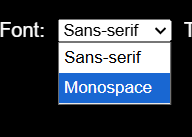

## 30/03/2026

### wat heb ik gedaan vandaag?

vandaag ben ik begonnen met een opzet maken van mijn project en heb ik een mp4 ingeladen en die heeft een transcriptie. Je kan ook de grote van de tekst aanpassen.

### wat heb ik geleerd?

ik heb geleerd dat er een video tag is en dat je daarma filmpjes kan transcriben.

### wat ga ik morgen doen?

usertest houden met mijn persoon en daarna feedback aanpassingen maken op mijn design

## 31/03/2026

### eerste user test

### Bevindingen uit de test
 
**Vervelende aannames die mensen hebben:**
- Mensen denken vaak dat iemand die doof is *nog wel iets* kan horen — dit klopt niet altijd
- Mensen praten soms zonder dat de dove persoon ziet dat ze aangesproken worden
- De testpersoon wil altijd kunnen zien wanneer iemand tegen haar praat
 
**Wat de testpersoon mist bij gewone ondertiteling:**
- Wie er spreekt
- Achtergrondgeluiden en hun betekenis
- Welk liedje er speelt
- Emotie en toon van de stem
- Informatie die je normaal *hoort* maar niet *ziet*
 
---
 
## 🗂️ Prioriteitenlijst (meest → minst urgent)
 
### 🔴 Must Have — direct impact op begrip
 
| # | Feature | Omschrijving |
|---|---------|--------------|
| 1 | **Spreker naam + kleur** | Elke spreker krijgt een eigen kleur en naam, bijv. geel voor persoon A, wit voor persoon B |
| 2 | **Achtergrondgeluid omschrijven** | Bijv. `[spannende muziek]` of `[deur slaat dicht]` |
| 3 | **Emotie / toon tonen** | Via kleur, label `(angry)` of emoji 😤 |
| 4 | **Sans-serif / monospace font** | Betere leesbaarheid tijdens het kijken |
| 5 | **Goed contrast** | Ondertitels zijn altijd leesbaar, ongeacht achtergrond |
 
### 🟠 Should Have — grote meerwaarde
 
| # | Feature | Omschrijving |
|---|---------|--------------|
| 6 | **Font aanpasbaar** | Lettertype én grootte instelbaar door de gebruiker |
| 7 | **Achtergrondmuziek benoemen** | Bijv. `[lied: Billie Eilish – Happier Than Ever]` of `[rustige pianomuziek]` |
| 8 | **Kleur geeft sfeer aan** | Bijv. rood = gevaar, blauw = rustig, geel = spanning |
| 9 | **Transcriptie onder de film** | Volledig leesbare tekst onder de video om terug te lezen |
 
### 🟡 Nice to Have — extra polish
 
| # | Feature | Omschrijving |
|---|---------|--------------|
| 10 | **Equalizer / achtergrond hue** | Achtergrondkleur pulseert mee met het geluid of de sfeer |
| 11 | **Naam tonen als spreker niet in beeld is** | Zodat je altijd weet wie praat, ook als het gezicht niet zichtbaar is |
| 12 | **Liedjesnaam tonen** | Welk nummer er op de achtergrond speelt |
 
---
 
 ## Week 1

 Deze week heb ik mijn eerste test gehouden Hierdoor werd de opdracht een stuk duidelijker en kreeg ik een idee in welke richting ik wil gaan. Ik heb ervoor gekozen om een video speler te gaan maken en de clip die ik hiervoor heb gekozen is een clip van the office.  Uit de test kwam wat voor lettertype Darice fijn vind namelijk Sans-serif en monospace font Hiervoor heb ik een optie toegevoegd zodat je kan wisselen van fonts.  
 

## 07/04/2026

### wat heb ik gedaan vandaag?

vandaag heb ik een user test gehouden en ben ik bezig geweest met de feedback weer te verwerken in het project.

### wat heb ik geleerd vandaag

vandaag heb ik geleerd dat het een heel ander gesprek is als iemand slecht horend is en wat goede design principes zijn voor mensen met een beperking.

### wat ga ik volgende keer doen?

Weer een user test doen 

## 13/04/2026

### wat heb ik gedaan vandaag?

vandaag aanpassingen gemaakt voor de 2e test

### wat ga ik volgende keer doen?

Usertest houden en weer wat kleine aanpassingen voor de volgende test.

## 14/04/2026

### wat heb ik gedaan vandaag?

vandaag heb ik mijn 2e test gehouden.

### wat heb ik geleerd vandaag

dat als je geen goed contrast hebt voor je achtergrond geluiden ze niet duidelijk zijn

### wat ga ik volgende keer doen?

Ik ga aanpassingen toevoegen zoals een hue

### 2e usertest

Bevindingen:

voor de normalieteid voeg ook de uhm enzo toe te voegen.

content zo duidelijk mogelijk. Vooral straight to the point.

Hoe zou je het op mobiel laten zien en misschien een mobiele versie maken als er tijd is natuurlijk

nadenken over sterkere worden of je die kan stylen en of dat echt nodig is

wat vind ze van de hue als achtergrond 

als het word ervaren als een geheel het moet iets toevoegen kleuren maken niet echt uit zolang het iets toevoegd. 

misschien als je de film pauzeert dat je dan relevante informatie te zien krijgt van de film/serie

Niet te druk!!!!!!!!!!!!!!!!!!!!!!

tekst animatie is goed zolang het subtiel is maar niet te moet goed zichtbaar zijn

achtergrond tekst bijv bij een piep dan met tekst laten spelen irritante geluiden een andere kleur geven en een full expierience mode toevoegen die aan en uit gezet kan worden

## week 2

deze week ben ik bezig geweest met het stylen van de video uit de test kwam dat hoe ik mijn subitles eerst had dus naam en dan de subtitles er onder dit heb ik veranderd naar naam: tekst achtergrond geluiden toegevoegd in een grijzere toon. Zo is er een onderscheid tussen achtergrond geluiden en dat van wat een character zegt. Met de docent besproken dat ik niet veel met de video clip kan doen dus toen geswitched naar een video clip van bladerunner hierin kan ik meer spelen met geluid.

## 20/04/2026

### wat heb ik gedaan vandaag?

vandaag ben ik geswitched van video clip en ben ik bezig geweest met het maken van een hue en een piep die steeds groter en groter word 

## 21/04/2026

## 3e test

piep geluid geel maken zodat het nog irritanter is maar voor de rest is het wel duidelijk dat het een irritante piep is en miss kijken naar hue grote.

## wat heb ik gedaan vandaag?

en een usertest gehouden om te zien of de nieuwe video clip werkt en goed uitgelegt word
de piep verandert deze was eerst grijs maar geel is een betere optie

## week 3

Deze week ben ik bezig geweest met een nieuwe video clip hiervoor heb ik gekozen vanwege feedback gesprek in week 2. De nieuwe video clip werkt goed ik kan nu een iritante piep laten zien en zo heb ik wat speeling met geluid

## 4e test 

gele piep is beter. Kijkt niet echt naar de hue omdat ze meer focused op de piep dus voelde de hue een beetje nutteloos. Voor de rest vond ze het goed.

## study situation

Deze was vrij goed te doen omdat je wekkelijks samen met je test persoon bezig bent zo kan je precies waar ze moeite mee heeft en wat haar goed afgaat. Hier ben ik het ook mee eens zeker als je het voor een kleine doelgroep maakt

## ignore conventions

Er wordt altijd geleerd dat het goed bruikbaar moet zijn voor allegebruikers dus zou een hue niet voor iedereen zijn het zelfde zoals de piep toon. En Zelf ben ik het niet eens met ignoring convetions omdat die er voor een reden zijn hoewel ze niet voor iedereen zijn is iets maken voor 98% beter dan voor maar 2% maken tenzij je het echt specefiek voor een opdracht gever maakt of persoon

## prioritise identity

een eigen identity maken is vrij moeilijk zeker als je het aan het maken bent voor 1 persoon die heel goed weet wat ze wel en niet wilt. Ik ben het wel mee eens in  een ze van websites is het goed om een eigen identity te hebben zo kunnen mensen het makkelijk terug vinden

## add nonsense

Dit gaat tegen all mijn princiepes aan zoals het maken van de piep normaal hou je dat maar een grote nu wordt die steeds groter en groter en dan ook de Hue die veranderd want we zijn altijd geleerd dat een website niet te gek moet zijn omdat het dan mensen kan afschrikken.

## bronnen 

blade runner clip

https://www.youtube.com/watch?v=vrP-_T-h9YM&t=114s 

